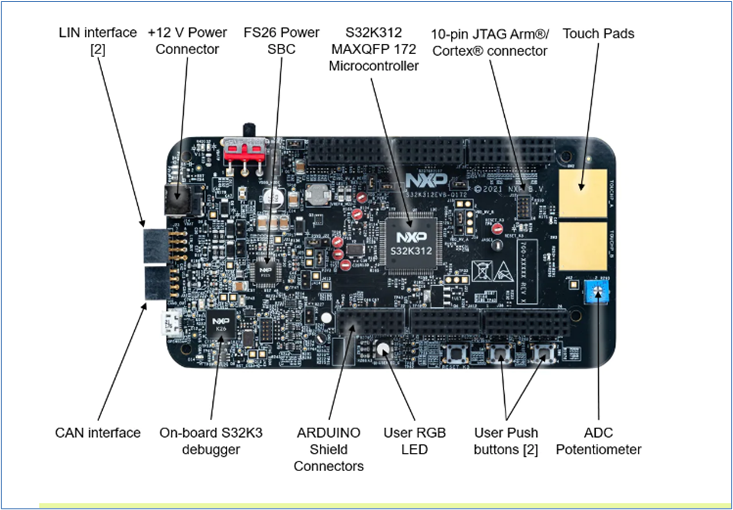
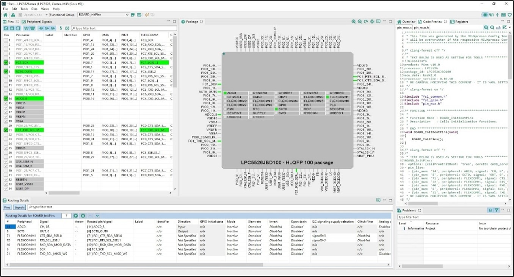
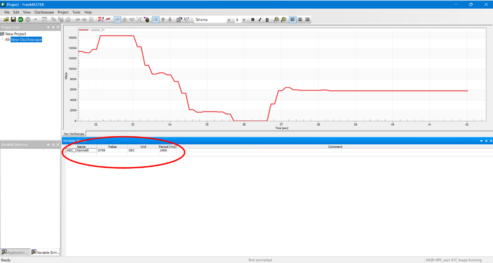
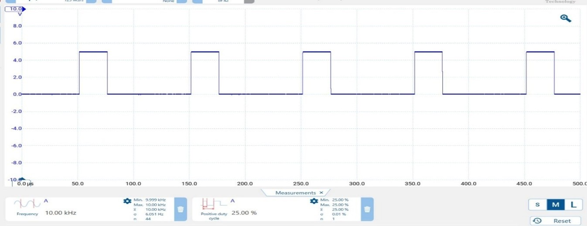

# Internship Report: Albonair India Pvt Ltd

## 📝 Overview
This repository contains the documentation and insights gained during my professional internship at **Albonair India Pvt Ltd**, located in **Ennore, Chennai**. The internship provided a holistic understanding of industrial workflows, particularly within the **Production** and **Development** departments.

---

## 🎯 Objective
The primary objective of this internship was to **bridge the gap between academic learning in B-Tech Biomedical Engineering and practical industrial applications**, especially in the field of **automotive exhaust aftertreatment systems**.

---

## 🛠️ Technical Focus: Simulink & NXP
A significant portion of the internship was dedicated to a development project within the **Simulink environment**. Key technical activities included:

- **Model Configuration:** Configuring **NXP-based microcontroller models**.
- **Creation & Integration:** Creating and integrating these models for **system simulation**.

- **Model-Based Design:** Utilizing the **Model-Based Design Toolbox (MBDT)** for system modeling.

---

## 🏭 Departmental Insights

### Production Department
Gained insights into the **manufacturing processes and operational dynamics** involved in producing **automotive exhaust aftertreatment systems**.

### Development Department
Focused on **system modeling, simulation, and microcontroller integration**, enhancing practical understanding of embedded system development.

--- 

---

## 🔑 Key Keywords
`NXP` | `MBDT` | `Simulink Modelling` | `Production` | `Development` | `System Simulation`

---

## 🙏 Acknowledgments
I would like to extend my sincere gratitude to the leadership and support team at **Albonair India Pvt Ltd** for their guidance during my internship:

- **Mr. Thirukumaran** – Vice President, Head of Operations  
- **Mr. Ananth Kumar** – General Manager  
- **Mrs. Vanathi & Mr. Rathinagireeswaran** – HR and Operations Support  
- **Ms. Abinaya & Ms. Devi** – HR Coordination

Their mentorship and support made this internship a valuable and enriching learning experience.